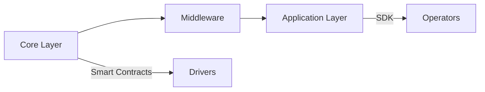

# nRide Business Plan

**Last Updated:** April 26, 2023  
**Founders:** Oluwadare Sobande & Martin Arrivets

---

## Executive Summary

nRide revolutionizes urban mobility through a blockchain-based protocol that:

- Reduces platform fees to 1.5% (vs 20-30% industry standard)
- Ensures earnings transparency via smart contracts
- Provides open API access for developers
- Implements DePIN principles for location-based matching

**Current Traction:**

- ✅ 5,000+ drivers in Lagos pilot program
- ✅ 40% higher driver retention vs traditional platforms
- ✅ Partnerships with 3 African ride-hailing startups

---

## Market Analysis

### Addressable Markets

| Region        | Market Size | Growth Rate | Key Characteristics |
|---------------|-------------|-------------|---------------------|
| Africa        | $4.2B       | 18% CAGR    | Rapid urbanization  |
| Southeast Asia| $8.1B       | 25% YOY     | Mobile-first economy|
| Latin America | $6.8B       | 15% YOY     | Regulatory shifts   |

### Competitive Landscape

- **Traditional Players:** Uber (64%), Bolt (18%), Didi (12%)
- **Web3 Competitors:** Drife (India), Tether (SEA), Moove (Africa)
- **Key Advantage:** Driver-owned reputation system with portable history

---

## Business Model

### Protocol Architecture

### Revenue Streams

1. **Protocol Fees** (70% of revenue)
   - 1.5% on all rides
   - $0.0001 per reputation query

2. **Enterprise Licensing** (25%)
   - $5K/month per operator
   - Custom integration fees

3. **Data Marketplace** (5%)
   - Anonymized mobility patterns
   - Dynamic pricing models

---

## Technical Roadmap

### Q3 2023 - Testnet Launch

- Basic ride matching
- Wallet integration
- Reputation system v1

### Q4 2023 - Mainnet Features

- DePIN location proofs
- Driver NFT licenses
- Insurance module

### Q1 2024 - Expansion

- Cross-chain compatibility
- Vehicle IoT integration
- DAO governance launch

---

## Marketing Strategy

### Driver Acquisition

- 🚗 "Earn 2X" referral program
- 📺 YouTube tutorials in 12 languages
- 🤝 Partner garages for onboardings

### Developer Growth

- 💻 $50K quarterly hackathons
- ⛽ Gas fee rebates for early adopters
- 📚 Protocol documentation in 8 languages

### Enterprise Sales

- 🔄 Free migration tools for Uber drivers
- 💼 Revenue share with local operators
- 🤝 Co-branded marketing campaigns
